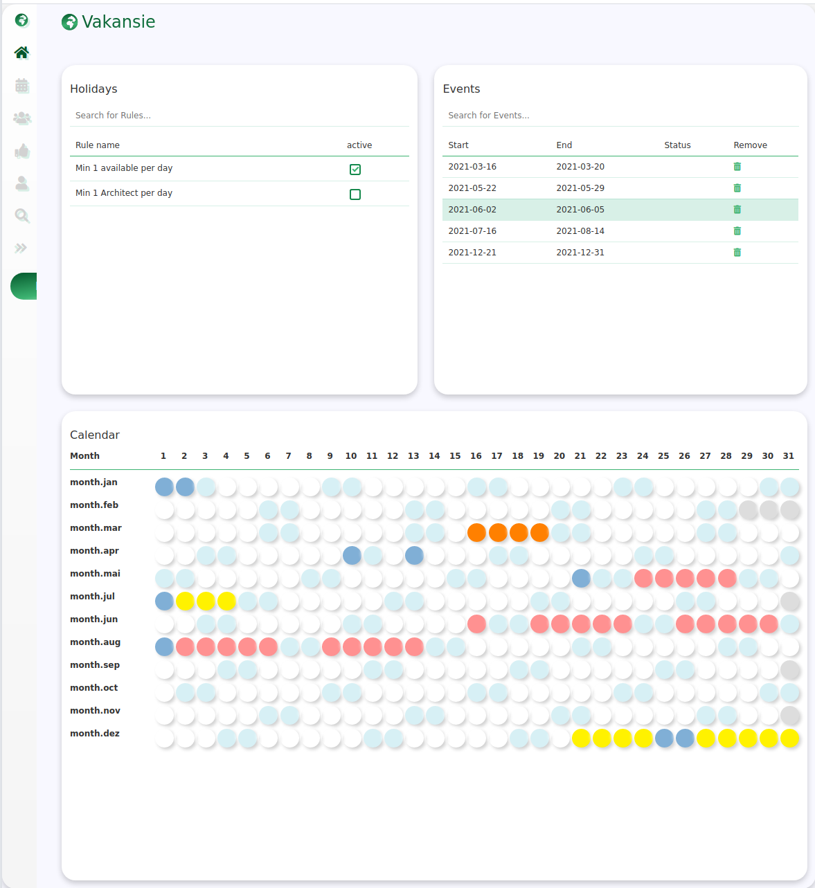

# Vakansie 


<!--- These are examples. See https://shields.io for others or to customize this set of shields. You might want to include dependencies, project status and licence info here --->


<!---->

A vacation planer that serves as my personal tech toolkit 

Vakansie is a web app that contains many concepts and examples from a technical point of view. 
To that, concepts shall be applicable and testable in a fast way to earn knowledge. One of my favorite part. 
This project shall help me to grow and specialize my skills. 



## Installing vakansie

To install vakansie, follow these steps:

``` 
git clone https://github.com/mab9/vakansie.git
open ./vakansie-frontend/index.html in your favorite browser
```

**Only the frontend part of the web app is available at the moment.** 

## JS frontend framework

Some planned components:

- Router
- JWT 
- Menu rights, view, ctrl
- Rest client / http and mocks
- test framework
- Architectural descriptions

**Sooner or later I will extract the frontend framework into a dedicated repository**

## My next ideas

There will be a lot of tech stuff within this repo. To find a good structural overview about all those ideas is crucial.

### Frontend 
- provide style guide 
- provide new approval features
- provide 1 final styled and responsive template
- extract parts to build a frontend js framework
- provide templates to build responsive websites
- build multiple frontends with different js frameworks like angular, react, vue and others
- compare different frontend frameworks

### Backend

- Build KISS backend with spring boot
- Build backend from scratch without spring
- Make use of spring security
- Make different modules with demos for prepared and non prepared sql statements
- Use and explain different patterns (Strategy, State, Decorator, Factory and more)


### Database

- Use different db technologies, NoSql, GraphQl and more
- Use postgres and try to tweak the db to the best, fine tuning

### Testing

- Use Apache JMeter to make performance tests
- Test Canary release
- Use Mockito and make some examples how to use it

### Installation and CI/CD

- Use stack Kubernetes, Helm, docker 
- Use multiple environments 

## Contributing to Vakansie

<!--- If your README is long or you have some specific process or steps you want contributors to follow, consider creating a separate CONTRIBUTING.md file--->
To contribute to Vakansie, follow these steps:

1. Fork this repository.
2. Create a branch: `git checkout -b <branch_name>`.
3. Make your changes and commit them: `git commit -m '<commit_message>'`
4. Push to the original branch: `git push origin vakansie/<location>`
5. Create the pull request.

Alternatively see the GitHub documentation on [creating a pull request](https://help.github.com/en/github/collaborating-with-issues-and-pull-requests/creating-a-pull-request).

## Contributors

Thanks to the following people who have contributed to this project:

* [@mab9](https://github.com/mab9) 📖

<!-- You might want to consider using something like the [All Contributors](https://github.com/all-contributors/all-contributors) specification and its [emoji key](https://allcontributors.org/docs/en/emoji-key). -->

## Contact

If you want to contact me you can reach me at **marcantoine.bruelhart@gmail.com.**

## License
<!--- If you're not sure which open license to use see https://choosealicense.com/--->

This project uses the following license: [GNU GPLv3](https://choosealicense.com/licenses/gpl-3.0/).