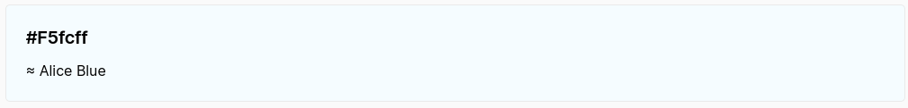
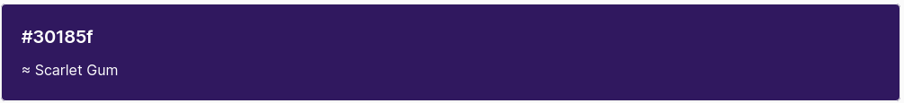
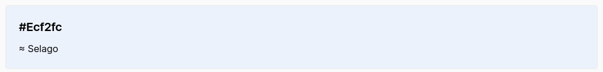
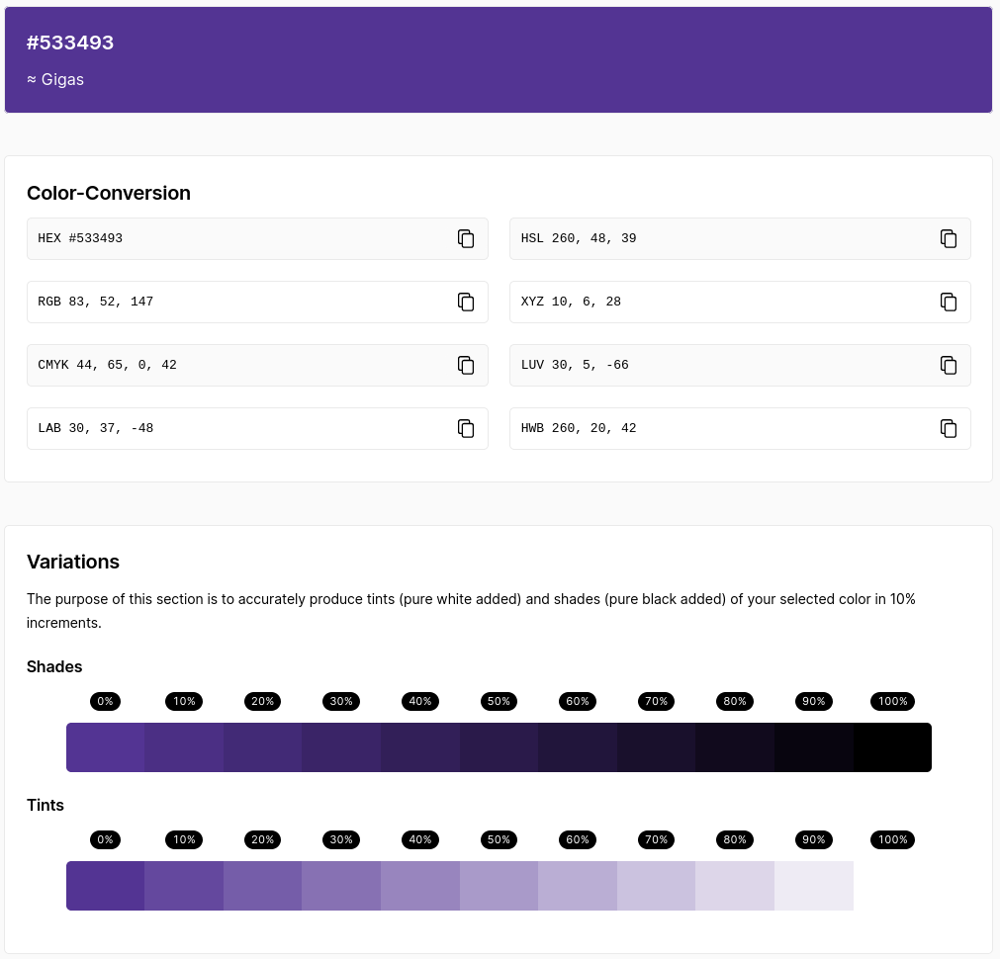
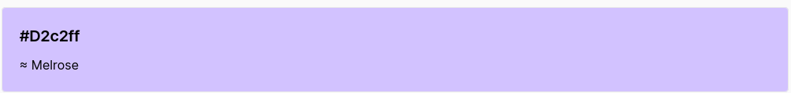
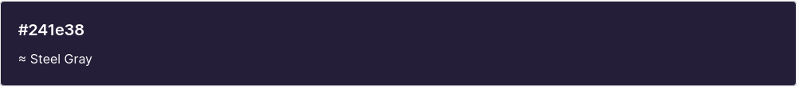
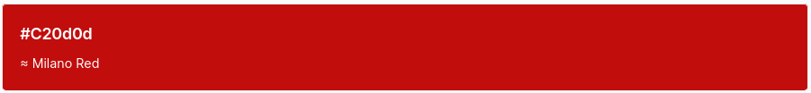
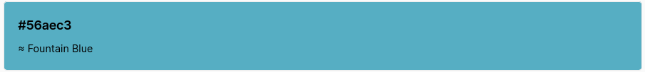
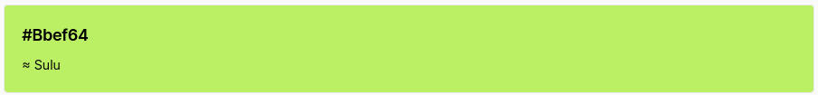
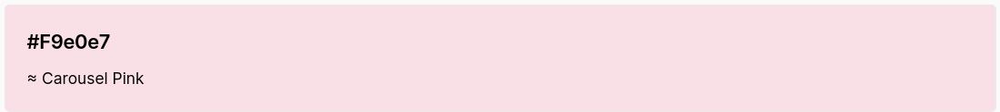

# Style guide

https://designmodo.com/create-style-guides/

## Links
### Reuse style guide with crawler

- http://stylifyme.com/ 
- http://stylifyme.com/?stylify=https%3A%2F%2Fwww.gitbook.com%2F

### Colors

Color palette maker: https://coolors.co/a31621-fcf7f8-ced3dc-4e8098-90c2e7

Color picker from image: https://imagecolorpicker.com/

Variations and Color Combinations: https://imagecolorpicker.com/color-code

## Vakansie Styleguide

### Background colors

[color-picker hex #513291](https://imagecolorpicker.com/color-code/513291)

### Text and Icon colors

 #d2c2ff
 #241e38
 #c20d0d
 #56aec3
 #bbef64
 #f9e0e7

### Typography Roboto

google fonts https://fonts.google.com/specimen/Roboto?preview.text_type=custom&sidebar.open=true&selection.family=Roboto:wght@100

<i class="fas fa-globe-africa"></i>

Header 1 'Roboto', sans-serif

Header 2 'Roboto', sans-serif

Header 3 'Roboto', sans-serif

Header 4 'Roboto', sans-serif

### Icons and more

 

< i class="fas fa-globe-africa"></i>

### Colors notes

hex: #513291
https://imagecolorpicker.com/color-code/513291

